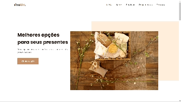

<h1 align="center"> RivaKits </h1>

  <a href="#-tecnologias">Tecnologias</a>&nbsp;&nbsp;&nbsp;|&nbsp;&nbsp;&nbsp;
  <a href="#-projeto">Projeto</a>&nbsp;&nbsp;&nbsp;|&nbsp;&nbsp;&nbsp;
  <a href="#-layout">Layout</a>&nbsp;&nbsp;&nbsp;

 

  

## 🚀 Tecnologias

Esse projeto foi desenvolvido com as seguintes tecnologias:

- HTML, CSS e JavaScript
- Figma
- Git e Github

## 💻 Projeto

A página faz parte de um projeto para introduzir às tecnologias da web. 
Utilizou-se a técnica mobile first, onde foi trabalhado também os conceitos de HTML, JavaScript e CSS em conjunto com o Figma.

## 🔖 Layout

Você pode visualizar o layout do projeto através [DESSE LINK](https://www.figma.com/file/MjAdtIpywbAL0ycA5a7csY/Origin-Six-(Community)?type=design&node-id=0%3A1&mode=dev&t=6LHRiHpruLhfnPIE-1). É necessário ter conta no [Figma](https://figma.com) para acessá-lo.